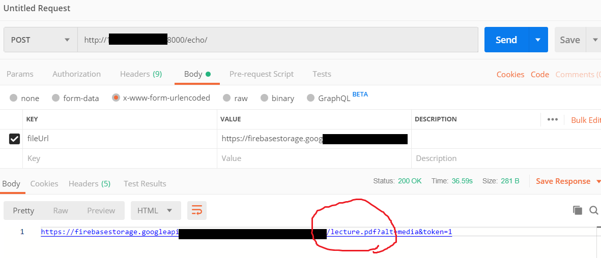

# boba_HWPtoPDF

## 개발 
------------------------------------------------------------------------------------------------------------------------------------------
||       Version    |      
|---| --------------------- |
|python3|      3.6.8     |  
|django|     2.2.4      |  
|ubuntu|     16.04      |   

---

## hwp -> xhtml
git clone https://github.com/mete0r/pyhwp.git
<br>
<hr>
xhtml -> pdf<br>
https://www.techoism.com/convert-html-document-to-pdf-on-ubuntu/

---

## 환경 변수 설정
[//]: # ({x-version-update-start:google-cloud-bom:released})
```xml
nano ~/.bashrc
export PATH="$PATH:/root/.local/bin"
export PATH="$PATH:/usr/local/bin"
```


---


